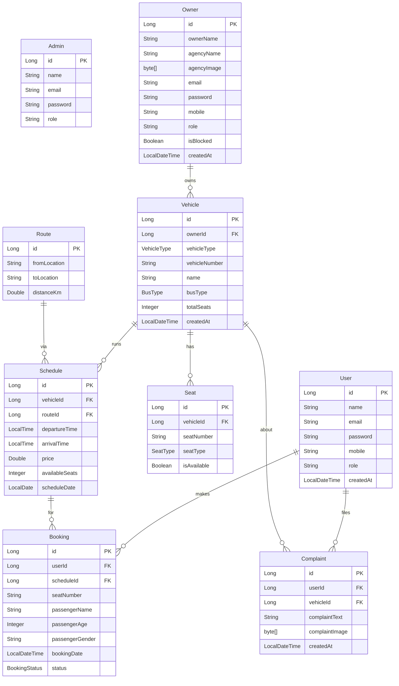
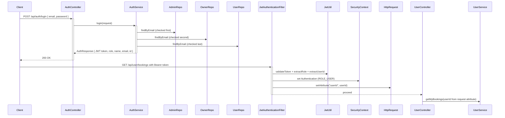

# YatraNow - Bus & Train Booking System

## Overview
YatraNow is a production-ready Spring Boot backend for a comprehensive bus and train booking platform. The system supports three distinct roles (Admin, Owner, User) with role-based access control and complete booking management features.

## Technology Stack
- **Java 17** - Latest LTS with modern features (records, text blocks, switch expressions)
- **Spring Boot 3.2.2** - Framework for REST APIs
- **MySQL 8.0+** - Relational database
- **Maven** - Project management and dependency resolution
- **Spring Security + JWT** - Authentication and authorization
- **JPA/Hibernate** - ORM for database operations
- **Lombok** - Reduces boilerplate code

## Key Features

### Multi-Role System
1. **ADMIN**
   - Manage users (view, delete)
   - Manage owners (view, block/unblock, delete)
   - No involvement in bookings or routes

2. **OWNER (Travel Operator)**
   - Immediate login after signup (no approval needed)
   - Upload agency logo (stored as BLOB in MySQL)
   - Add/manage buses and trains
   - Automatic seat generation based on bus type
   - Create routes and schedules with pricing
   - View bookings for their vehicles
   - Receive complaints with optional images

3. **USER**
   - Register and login
   - Search buses/trains by from/to/date
   - Book tickets with seat selection
   - View booking history
   - Submit complaints with optional images

### Core Capabilities
- **Bus Type-Based Seat Auto-Generation**
  - Super Luxury: 40 seats (2x2 layout)
  - Deluxe: 45 seats
  - Sleeper: 36 seats (L1-L18, U1-U18)
  - Seater: 52 seats (3x2 layout)

- **Image Storage**: All images stored as BLOB in MySQL - no file paths
- **Double Booking Prevention**: Database unique constraints + service-level checks
- **JWT Authentication**: Secure stateless authentication
- **Role-Based Authorization**: Endpoint protection by role
- **Global Exception Handling**: Meaningful error responses
- **Validation**: Comprehensive input validation
- **Pagination & Sorting**: Search results sortable by price/time

## Prerequisites
- **JDK 17** or higher
- **Maven 3.8+**
- **MySQL 8.0+**
- **Postman** (optional, for API testing)

## Database Setup

### Step 1: Create Database
```sql
CREATE DATABASE yatranow;
```

### Step 2: Configure Connection
The database connection is pre-configured in `application.properties`:
```properties
spring.datasource.url=jdbc:mysql://localhost:3306/yatranow?createDatabaseIfNotExist=true&useSSL=false&allowPublicKeyRetrieval=true
spring.datasource.username=root
spring.datasource.password=root
```

**Note:** Change credentials if your MySQL uses different settings.

## Running the Application

### Method 1: Using Maven (Development)
```bash
cd YatraNow
mvn clean install
mvn spring-boot:run
```

The application will start on `http://localhost:9090`

### Method 2: Using JAR (Production)
```bash
# Build JAR
mvn clean package -DskipTests

# Run JAR
java -jar target/yatranow-backend-1.0.0.jar
```

## Seed Data
The application automatically seeds sample data on first startup:
- **Admin**: `suresh@gmail.com` / `Suresh@55`
- **5 Sample Owners** with agencies
- **6 Vehicles** (4 buses, 2 trains) with auto-generated seats
- **10 Popular Routes** (Mumbai-Pune, Delhi-Jaipur, etc.)
- **Schedules** for next 7 days with varying prices

## API Endpoints

### Authentication (`/api/auth`)
| Method | Endpoint | Description | Access |
|--------|----------|-------------|--------|
| POST | `/register/user` | User registration | Public |
| POST | `/register/owner` | Owner registration (multipart) | Public |
| POST | `/login` | Login for all roles | Public |

### Admin (`/api/admin`) - Requires ADMIN role
| Method | Endpoint | Description |
|--------|----------|-------------|
| GET | `/users` | List all users (paginated) |
| DELETE | `/users/{id}` | Delete user |
| GET | `/owners` | List all owners (paginated) |
| PATCH | `/owners/{id}/block` | Block/unblock owner |
| DELETE | `/owners/{id}` | Delete owner |

### Owner (`/api/owner`) - Requires OWNER role
| Method | Endpoint | Description |
|--------|----------|-------------|
| POST | `/vehicles` | Create vehicle |
| GET | `/vehicles` | Get my vehicles |
| POST | `/routes` | Create route |
| POST | `/schedules` | Create schedule |
| GET | `/bookings` | Get bookings for my vehicles |
| GET | `/complaints` | Get complaints for my vehicles |

### User (`/api/user`) - Requires USER role
| Method | Endpoint | Description |
|--------|----------|-------------|
| POST | `/bookings` | Book ticket |
| GET | `/bookings` | Get my bookings |
| POST | `/complaints` | Submit complaint (multipart) |

### Public (`/api/public`) - No authentication required
| Method | Endpoint | Description |
|--------|----------|-------------|
| POST | `/search` | Search vehicles by from/to/date |
| GET | `/images/agency/{ownerId}` | Get agency logo |
| GET | `/images/complaint/{complaintId}` | Get complaint image |

## Sample API Calls

### 1. Register User
```bash
POST http://localhost:8080/api/auth/register/user
Content-Type: application/json

{
  "name": "John Doe",
  "email": "john@example.com",
  "password": "john123",
  "mobile": "9876543210"
}
```

### 2. Login
```bash
POST http://localhost:8080/api/auth/login
Content-Type: application/json

{
  "email": "admin@yatranow.com",
  "password": "admin123"
}

Response:
{
  "token": "eyJhbGciOiJIUzI1NiIsInR5cCI6IkpXVCJ9...",
  "role": "ADMIN",
  "name": "System Admin",
  "email": "admin@yatranow.com",
  "id": 1
}
```

### 3. Search Vehicles
```bash
POST http://localhost:8080/api/public/search?page=0&size=10&sortBy=price
Content-Type: application/json

{
  "fromLocation": "Mumbai",
  "toLocation": "Pune",
  "date": "2026-02-20"
}
```

### 4. Book Ticket (Requires USER token)
```bash
POST http://localhost:8080/api/user/bookings
Authorization: Bearer <USER_TOKEN>
Content-Type: application/json

{
  "scheduleId": 1,
  "seatNumber": "1A",
  "passengerName": "John Doe",
  "passengerAge": 30,
  "passengerGender": "Male"
}
```

## Project Structure
```
YatraNow/
├── src/main/java/com/yatranow/
│   ├── config/          # Security, DataSeeder
│   ├── controller/      # REST Controllers
│   ├── dto/             # Request/Response DTOs
│   ├── entity/          # JPA Entities
│   ├── exception/       # Custom Exceptions & Global Handler
│   ├── repository/      # Spring Data JPA Repositories
│   ├── security/        # JWT Utils, AuthFilter
│   ├── service/         # Business Logic Services
│   └── YatraNowApplication.java
├── src/main/resources/
│   └── application.properties
├── pom.xml
└── README.md
```

## Security
- **JWT Token Expiry**: 24 hours (configurable in `application.properties`)
- **Password Encryption**: BCrypt
- **Role-Based Access**: Spring Security with method-level authorization
- **Image Validation**: Type (JPEG/PNG) and size (max 5MB) checks

## Error Handling
All errors return standardized JSON responses:
```json
{
  "timestamp": "2026-02-17T21:00:00",
  "status": 400,
  "error": "Bad Request",
  "message": "Seat is already booked",
  "path": "/api/user/bookings"
}
```

## Validation
- Email format validation
- Mobile number: 10 digits
- Password: Minimum 6 characters
- Mandatory fields enforcement
- Business rule validations (double booking, owner verification)

## Troubleshooting

### MySQL Connection Issues
1. Ensure MySQL is running: `mysql -u root -p`
2. Verify credentials in `application.properties`
3. Check if database exists: `SHOW DATABASES;`

### Port Already in Use
Change port in `application.properties`:
```properties
server.port=8081
```

### Build Failures
```bash
# Clean and rebuild
mvn clean install -U
```

## Future Enhancements
- Payment gateway integration
- Email/SMS notifications
- Cancellation and refunds
- Seat selection UI/API
- Admin analytics dashboard
- Rating and review system

## Support
For issues or questions, contact the development team.

## License
Proprietary - YatraNow © 2026

---

# YatraNow Backend — Full Project Analysis

## Tech Stack

| Layer | Technology |
|---|---|
| Framework | Spring Boot 3.2.2 |
| Language | Java 17 |
| Database | MySQL (via JDBC) |
| ORM | Spring Data JPA / Hibernate |
| Security | Spring Security + JJWT 0.11.5 |
| Validation | Jakarta Bean Validation |
| Boilerplate | Lombok |
| Build Tool | Maven |
| Server Port | 8080 |

---

## Detailed Project Structure

```
src/main/java/com/yatranow/
├── YatraNowApplication.java        ← Spring Boot entry point
├── config/
│   ├── SecurityConfig.java         ← Security filter chain, CORS, BCrypt
│   └── DataSeeder.java             ← Startup DB seeding (@PostConstruct)
├── controller/
│   ├── AuthController.java         ← /api/auth/** (public)
│   ├── PublicController.java       ← /api/public/** (public GET)
│   ├── UserController.java         ← /api/user/** (ROLE_USER)
│   ├── OwnerController.java        ← /api/owner/** (ROLE_OWNER)
│   └── AdminController.java        ← /api/admin/** (ROLE_ADMIN)
├── dto/                            ← 10 Request/Response records
├── entity/                         ← 9 JPA entities
├── exception/                      ← 4 custom exceptions + GlobalExceptionHandler
├── repository/                     ← 9 JPA repositories
├── security/
│   ├── JwtUtil.java                ← Token generation & validation
│   └── JwtAuthenticationFilter.java ← OncePerRequestFilter
└── service/
    ├── AuthService.java
    ├── UserService.java
    ├── OwnerService.java
    ├── AdminService.java
    └── ImageService.java
```

---

## Data Model (Entities)



### Enums

| Entity | Enum | Values |
|---|---|---|
| `Vehicle` | `VehicleType` | `BUS`, `TRAIN` |
| `Vehicle` | `BusType` | `SUPER_LUXURY` (40), `DELUXE` (45), `SLEEPER` (36), `SEATER` (52) |
| `Seat` | `SeatType` | `SEATER`, `SLEEPER`, `SEMI_SLEEPER` |
| `Booking` | `BookingStatus` | `CONFIRMED`, `CANCELLED` |

---

## Full API Endpoint Catalog

### Auth — `/api/auth/**` (Public)

| Method | Endpoint | Description |
|---|---|---|
| POST | `/api/auth/register/user` | Register a new User (JSON body) |
| POST | `/api/auth/register/owner` | Register a new Owner (multipart/form-data with agency image) |
| POST | `/api/auth/login` | Login (Admin → Owner → User precedence) |

**Response**: `AuthResponse` record — `{ token, role, name, email, id }`

---

### Public — `/api/public/**` (No Auth Required)

| Method | Endpoint | Description |
|---|---|---|
| GET | `/api/public/routes` | All schedules as `SearchResponse` list |
| GET | `/api/public/route-list` | All routes (city pairs + distance) |
| GET | `/api/public/search?from=&to=&date=&page=&size=&sortBy=` | Paginated + sorted search for available schedules |
| GET | `/api/public/seats/{scheduleId}` | List of booked seat numbers for a schedule |
| GET | `/api/public/images/agency/{ownerId}` | Owner agency image (JPEG bytes) |
| GET | `/api/public/images/complaint/{complaintId}` | Complaint image (JPEG bytes) |

**Sort options**: `price` (default), `departureTime`

---

### User — `/api/user/**` (ROLE_USER required)

| Method | Endpoint | Description |
|---|---|---|
| POST | `/api/user/bookings` | Book a ticket (seat selection, passenger details) |
| GET | `/api/user/bookings` | View my bookings |
| POST | `/api/user/complaints` | Submit a complaint (multipart, optional image) |

---

### Owner — `/api/owner/**` (ROLE_OWNER required)

| Method | Endpoint | Description |
|---|---|---|
| POST | `/api/owner/vehicles` | Create a new vehicle |
| GET | `/api/owner/vehicles` | List my vehicles |
| POST | `/api/owner/routes` | Create a route |
| GET | `/api/owner/routes` | List all routes |
| PUT | `/api/owner/routes/{id}` | Update a route |
| DELETE | `/api/owner/routes/{id}` | Delete a route |
| POST | `/api/owner/schedules` | Create a schedule (for owned vehicle) |
| GET | `/api/owner/bookings` | View all bookings on my vehicles |
| GET | `/api/owner/complaints` | View complaints filed against my vehicles |

---

### Admin — `/api/admin/**` (ROLE_ADMIN required)

| Method | Endpoint | Description |
|---|---|---|
| GET | `/api/admin/users?page=&size=` | Paginated list of all users |
| DELETE | `/api/admin/users/{id}` | Delete a user |
| GET | `/api/admin/owners?page=&size=` | Paginated list of all owners |
| PATCH | `/api/admin/owners/{id}/block` | Toggle block/unblock an owner |
| DELETE | `/api/admin/owners/{id}` | Delete an owner |

---

## Security Architecture



**Key security points:**
- JWT tokens embed `email`, `role`, and `userId` as claims
- Token signing uses HS256 with a 72-char secret key
- Token expiry is **24 hours** (`86400000` ms)
- `userId` is passed via `HttpServletRequest` attribute, not re-fetched from DB
- CORS is configured with **wildcard origins** (`*`) — should be tightened for production

---

## Auto-Seat Generation

When a vehicle is created, seats are **automatically generated** based on vehicle/bus type:

| Bus Type | Seats | Layout | Seat Type |
|---|---|---|---|
| SUPER_LUXURY | 40 | 2×2 grid (1A–10D) | SEATER |
| DELUXE | 45 | 2×2 grid (1A–11D, capped) | SEATER |
| SLEEPER | 36 | L1–L18 + U1–U18 | SLEEPER |
| SEATER | 52 | 3×2 grid (1A–11E, capped) | SEATER |
| TRAIN | configurable | S1–S{n} | SEATER |

---

## Data Seeder (`DataSeeder.java`)

On first startup (skipped if `admins` table has data):

| What | Details |
|---|---|
| Admin | `admin@yatranow.com` / `admin123` |
| Owners (5) | Rajesh, Priya, Amit, Neha, Vikram with agencies |
| Vehicles | 4 buses (SUPER_LUXURY, DELUXE, SLEEPER, SEATER) + 2 trains |
| Routes (10) | Mumbai-Pune, Delhi-Jaipur, Bangalore-Chennai, etc. |
| Schedules | 3 per vehicle/route combo × 7 days (morning, afternoon, evening) |

Price formula: `distanceKm × 2.5 × timeMultiplier`

---

## Exception Handling

`GlobalExceptionHandler` (`@RestControllerAdvice`) maps all exceptions to structured `ErrorResponse`:

| Exception | HTTP Status |
|---|---|
| `ResourceNotFoundException` | 404 Not Found |
| `DuplicateBookingException` | 409 Conflict |
| `ImageProcessingException` | 400 Bad Request |
| `OwnerBlockedException` | 403 Forbidden |
| `BadCredentialsException` | 401 Unauthorized |
| `MethodArgumentNotValidException` | 400 Validation Failed |
| `DataIntegrityViolationException` | 409 Conflict |
| `Exception` (catch-all) | 500 Internal Server Error |

---

## DTOs (Data Transfer Objects)

All DTOs are Java **records** (immutable):

| DTO | Direction | Purpose |
|---|---|---|
| `LoginRequest` | → | `email`, `password` |
| `RegisterUserRequest` | → | `fullName`, `email`, `password`, `phoneNumber` |
| `RegisterOwnerRequest` | → | Owner details + `agencyImage` (MultipartFile) |
| `AuthResponse` | ← | `token`, `role`, `name`, `email`, `id` |
| `SearchRequest` | internal | `fromLocation`, `toLocation`, `date` |
| `SearchResponse` | ← | Full schedule details for browse/search |
| `BookingRequest` | → | `scheduleId`, `seatNumber`, passenger details |
| `BookingResponse` | ← | Full booking confirmation details |
| `ComplaintRequest` | → | `vehicleId`, `complaintText`, `complaintImage` (optional) |
| `ErrorResponse` | ← | `timestamp`, `status`, `error`, `message`, `path` |
| `VehicleCreateRequest` | → | `vehicleType`, `vehicleNumber`, `name`, `busType`, `totalSeats` |
| `RouteCreateRequest` | → | `fromLocation`, `toLocation`, `distanceKm` |
| `ScheduleCreateRequest` | → | `vehicleId`, `routeId`, times, `price`, `scheduleDate` |

---

## Key Design Observations

> **Dual FK + Lazy Relation pattern**: Entities store both a plain `Long` FK column (e.g., `vehicleId`) and a `@ManyToOne` lazy-loaded relation. The FK column is used for writes, the relation object for joins in JPQL queries.

> **Login precedence**: The login endpoint checks Admin → Owner → User in that order. A single shared endpoint handles all three roles.

> **Owner blocking**: Blocked owners get a `403 Forbidden` at login time, not at JWT validation — meaning a blocked owner's existing valid token still works until expiry.

> **De-normalized `availableSeats`**: `Schedule.availableSeats` is decremented on booking. This is vulnerable to race conditions under concurrent load without proper DB-level locking.

---

## Potential Improvement Areas

| Area | Issue | Suggestion |
|---|---|---|
| CORS | `allowedOrigins("*")` | Restrict to specific frontend origin in production |
| JWT Secret | Hardcoded in `application.properties` | Use env variables / secrets manager |
| Race Conditions | `availableSeats` decrement without locks | Use `@Lock(PESSIMISTIC_WRITE)` or optimistic locking |
| Blocked Token | Blocked owner's token still valid | Short expiry + token blacklist, or check `isBlocked` in filter |
| Test Coverage | No test files found in `src/test/` | Add unit and integration tests |
| Password in logs | SQL logging enabled (`show-sql=true`) | Disable in production |
| Image Storage | Images stored as `LONGBLOB` in MySQL | Offload to S3/cloud storage for scalability |
| Search | Exact match on `fromLocation`/`toLocation` | Add partial/fuzzy matching or a `LIKE` query |
